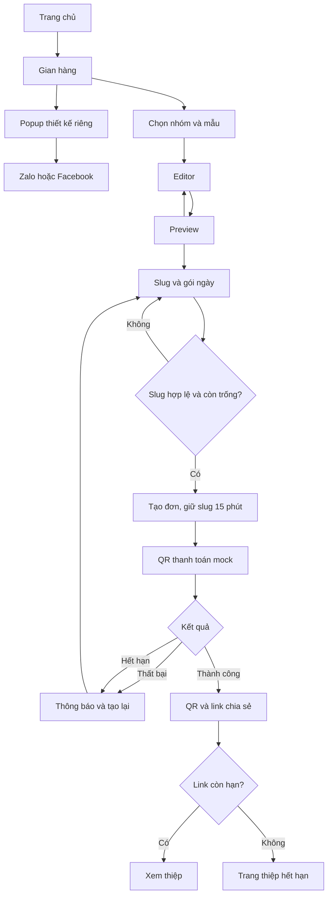

# 03. Luồng người dùng và hệ thống

> **Quy tắc hiện hành — URL tự động:** Khách chỉ sửa Page Title, không nhập hoặc chọn slug/domain. Preview → chỉnh title → chọn ngày → tạo đơn. Server cấp mã link bất định dạng `c-<32 ký tự hex>`; retry cùng phiên và Idempotency-Key giữ nguyên link. POST /api/orders chỉ nhận templateId, days, content; gửi thêm slug bị từ chối 422. GET /api/slugs/check ngừng hỗ trợ (410). Các mô tả chọn/kiểm tra slug phía dưới là lịch sử đã bị thay thế; slug trong dữ liệu vẫn là mã nội bộ để định tuyến QR. Link cũ không đổi.

## Luồng bổ sung

**Page Title đã bổ sung:** Editor nhập title → Preview hiển thị tên tab dự kiến → tạo đơn lưu trong content.pageTitle → người nhận mở /c/slug → generateMetadata đọc title khi thiệp còn hạn. Domain, URL và QR không thay đổi theo title. Hết hạn/không tìm thấy trả title trạng thái chung.

**Media photobooth chưa triển khai:** tạo phiên → upload → kiểm tra/làm sạch → render PNG đúng revision → tạo đơn → xác nhận thanh toán → phát hành READY → QR trang thiệp → xem/tải qua API kiểm tra expiresAt → xoá file theo job. Mermaid và nhánh lỗi đầy đủ tại [tài liệu 11, mục 4](11-photobooth-storage-qr.md#4-luồng-hệ-thống). QR không encode URL bucket hoặc signed download URL.




```mermaid
sequenceDiagram
 participant U as Trình duyệt
 participant API as Next API
 participant DB as PostgreSQL
 participant PG as PaymentProvider
 participant JOB as Cleanup
 U->>API: POST orders, cookie, idempotency key
 API->>API: Origin, validate, tính giá server
 API->>DB: Serializable: giải phóng giữ chỗ cũ + claim slug + card + order
 alt Trùng slug
 DB-->>API: Unique conflict
 API-->>U: 409 SLUG_TAKEN
 else Thành công
 API-->>U: 201 order + payment QR payload
 end
 U->>API: POST mock success/fail
 API->>PG: Chuẩn hoá payment event
 API->>DB: Lock transaction, đối chiếu ID/amount/VND/deadline
 alt Đủ tiền trước hạn
 API->>DB: Payment unique, order PAID, card ACTIVE, qr_link
 else Sai tiền, thất bại hoặc quá hạn
 API->>DB: Ghi nhận event; không kích hoạt, REVIEW nếu tiền đến muộn/sai
 end
 U->>API: GET order (poll mỗi 3 giây)
 API-->>U: Trạng thái, link nếu đã PAID
 U->>API: GET /c/slug
 API->>DB: Tra card và expiresAt
 API-->>U: Nội dung còn hạn hoặc trang thông báo no-store
 JOB->>DB: Expire, release reservation, purge content sau 7 ngày
```

Refresh payment/result khôi phục bằng ID trên URL và cookie. Đóng tab không huỷ đơn. Mất mạng không coi là thất bại thanh toán: cho thử tải lại và đọc trạng thái server trước. Trang preview không có draft hướng dẫn về chọn mẫu.
