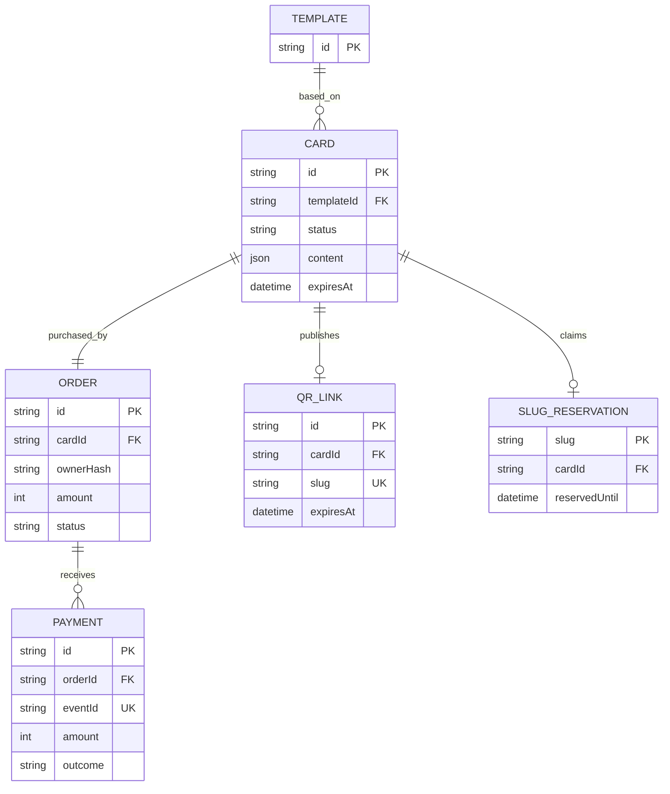

# 05. Dữ liệu

> **Đã triển khai tải ảnh trực tiếp:** Editor chọn tệp JPEG/PNG/WebP (15 MB), nén WebP và lưu riêng trong PostgreSQL; ảnh nháp 24 giờ, ảnh xuất bản theo thời hạn thiệp. Chi tiết: [Tải ảnh điện thoại](13-direct-image-upload.md). Các mô tả chỉ hỗ trợ URL ảnh trước đây đã được thay thế. Private object storage và xuất ảnh tổng hợp trong tài liệu 11 vẫn là lộ trình.

> **Quy tắc hiện hành — URL tự động:** Khách chỉ sửa Page Title, không nhập hoặc chọn slug/domain. Preview → chỉnh title → chọn ngày → tạo đơn. Server cấp mã link bất định dạng `c-<32 ký tự hex>`; retry cùng phiên và Idempotency-Key giữ nguyên link. POST /api/orders chỉ nhận templateId, days, content; gửi thêm slug bị từ chối 422. GET /api/slugs/check ngừng hỗ trợ (410). Các mô tả chọn/kiểm tra slug phía dưới là lịch sử đã bị thay thế; slug trong dữ liệu vẫn là mã nội bộ để định tuyến QR. Link cũ không đổi.

## Bổ sung Page Title và thiết kế media

`card.content.pageTitle`: chuỗi Unicode, trim, tối đa 80 ký tự, không ký tự điều khiển; thiếu/trống dùng mặc định từ src/lib/page-titles.ts. Dùng JSON hiện có nên không cần migration. Giá trị được snapshot khi tạo đơn, tham gia requestHash/idempotency và bị purge cùng content; không dùng làm slug hoặc domain. Không trả title riêng qua metadata khi card hết hạn.

Schema media tương lai gồm media_session/media_asset/media_job và publicationStatus, đặc tả ở [tài liệu 11, mục 6](11-photobooth-storage-qr.md#6-schema-bổ-sung-dự-kiến), **chưa có migration**. Session tồn tại trước card, gắn một lần khi tạo đơn; binary ở object storage riêng tư, DB chỉ lưu object key/metadata. card/qr_link/session/asset phát hành dùng chung expiresAt. Ghi job outbox cùng transaction DB vì DB/storage không có transaction nguyên tử chung.

Retention 7 ngày ở trên áp dụng JSON nội dung, không cho phép xem thêm ảnh. Media đề xuất chặn ngay expiresAt và xoá binary mục tiêu trong 24 giờ; giữ tombstone slug. Xoá order sau 90 ngày không được xoá mất job dọn file chưa hoàn tất.

Tên model Prisma PascalCase, bảng SQL tương ứng bằng @@map. DateTime lưu UTC, tiền số nguyên VND, ID cuid. Không lưu ảnh hoặc nhạc dạng binary trong DB.

| Bảng | Cột và ràng buộc |
|---|---|
| template | id PK; name; category (COUPLE/FAMILY/OCCASION); palette; icon; description; 12 hàng seed, không xoá khi đã được tham chiếu |
| card | id PK; templateId FK; slug (không unique vì draft thất bại được tạo lại); content JSON nullable; status DRAFT/ACTIVE/EXPIRED; activatedAt?, expiresAt?, purgedAt?; createdAt default now; index status/expiresAt |
| order | id PK; cardId FK unique; ownerHash; idempotencyKey unique; requestHash; days; amount; currency VND; status PENDING/PAID/FAILED/EXPIRED/REVIEW; createdAt; paymentDeadline; paidAt?; index status/paymentDeadline |
| payment | id PK; orderId FK; eventId unique; provider; amount; currency; outcome SUCCESS/FAILED/REVIEW; receivedAt; index orderId; mỗi event chỉ một lần |
| qr_link | id PK; cardId FK unique; slug unique; expiresAt; createdAt; URL được tính từ APP_URL + /c/slug, QR sinh động không lưu PNG |
| slug_reservation | slug PK; cardId FK unique; reservedUntil nullable: null = giữ vĩnh viễn sau phát hành; reservation chưa thanh toán có hạn 15 phút |

Nội dung card: recipient, sender, message, background (#RRGGBB), icon (heart/star/flower), animation (none/float/sparkle), imageUrl?, musicUrl?. Snapshot bất biến sau tạo đơn. Giá lưu trên order để thay bảng giá không ảnh hưởng đơn cũ.

## Tính nhất quán
Claim slug và tạo card/order trong một transaction serializable. Unique slug_reservation ngăn race; retry P2034 giới hạn 3 lần. paid/order/card/qr_link/reservation cùng transaction. qr_link giữ tombstone sau xoá nội dung nên QR cũ không dẫn đến người mới. Cookie khách ngẫu nhiên 256 bit, chỉ lưu SHA-256 trong order. Idempotency key thuộc owner và fingerprint request; reuse khác dữ liệu trả 409.

## Retention
Đơn PENDING quá hạn được đánh EXPIRED và release reservation. Card ACTIVE hết hạn chuyển EXPIRED. Sau 7 ngày kể từ expiresAt hoặc paymentDeadline của đơn chưa kích hoạt: content=null, purgedAt=now. Sau 90 ngày kể từ tạo đơn: xoá payment/order, giữ card tối thiểu không content và qr_link để trả hết hạn. Chính sách pilot cần PO và chuyên gia pháp lý xác nhận trước mở bán; không khẳng định đáp ứng nghĩa vụ lưu trữ kế toán.
