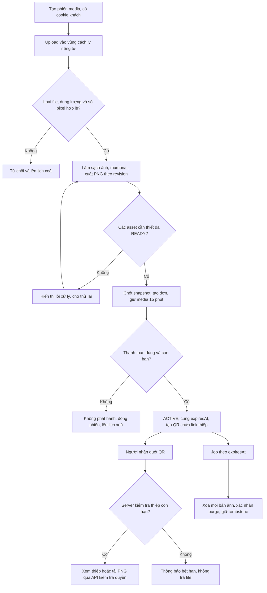
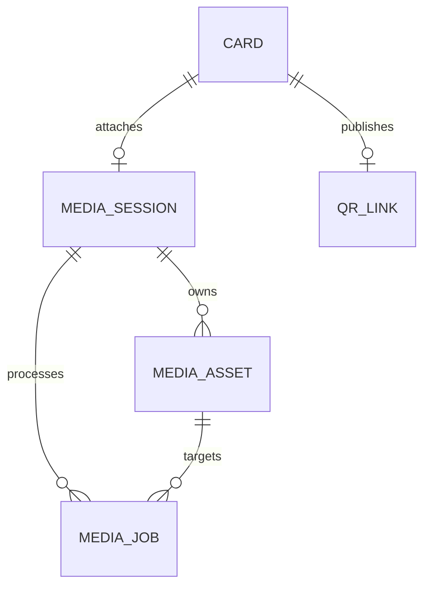

# 11. Lưu trữ ảnh và phát hành QR theo mô hình photobooth

> **Đã triển khai tải ảnh trực tiếp:** Editor chọn tệp JPEG/PNG/WebP (15 MB), nén WebP và lưu riêng trong PostgreSQL; ảnh nháp 24 giờ, ảnh xuất bản theo thời hạn thiệp. Chi tiết: [Tải ảnh điện thoại](13-direct-image-upload.md). Các mô tả chỉ hỗ trợ URL ảnh trước đây đã được thay thế. Private object storage và xuất ảnh tổng hợp trong tài liệu 11 vẫn là lộ trình.

> **Quy tắc hiện hành — URL tự động:** Khách chỉ sửa Page Title, không nhập hoặc chọn slug/domain. Preview → chỉnh title → chọn ngày → tạo đơn. Server cấp mã link bất định dạng `c-<32 ký tự hex>`; retry cùng phiên và Idempotency-Key giữ nguyên link. POST /api/orders chỉ nhận templateId, days, content; gửi thêm slug bị từ chối 422. GET /api/slugs/check ngừng hỗ trợ (410). Các mô tả chọn/kiểm tra slug phía dưới là lịch sử đã bị thay thế; slug trong dữ liệu vẫn là mã nội bộ để định tuyến QR. Link cũ không đổi.

Ngày bổ sung: 01/10/2026. Trạng thái: **đặc tả mở rộng, chưa triển khai trong code MVP**. Tài liệu mô tả trải nghiệm tương tự photobooth: khách tạo bộ ảnh, hệ thống lưu bản số, xuất QR, người nhận quét để xem và tải trong thời gian giới hạn. Không mặc định mọi máy photobooth thương mại đều dùng cùng kiến trúc hoặc cùng thời hạn lưu.

## 1. Cách hoạt động dễ hiểu

Một lượt tạo thiệp tương ứng một phiên photobooth. Ảnh được tải lên, ghép vào mẫu, xuất thành ảnh hoàn chỉnh và lưu trong kho riêng của hệ thống. Sau thanh toán, khách nhận một QR dẫn đến trang thiệp có ảnh và nút tải xuống.

**QR chỉ chứa đường link, không chứa ảnh và không tự đếm ngày.** Khi quét QR, server kiểm tra thời hạn của thiệp rồi mới cho xem hoặc tải ảnh. Bản PNG QR có thể tồn tại mãi trên điện thoại hoặc giấy in; khi link hết hạn, quét lại chỉ thấy thông báo hết hạn. QR thanh toán và QR nhận ảnh là hai mã khác nhau.

| Thành phần | Lưu ở đâu | Ý nghĩa |
|---|---|---|
| File ảnh đầu vào, ảnh đã xử lý, thumbnail, ảnh thiệp xuất | Object storage riêng tư tương thích S3 | Lưu dữ liệu binary, không public đường dẫn trực tiếp |
| Chủ sở hữu, object key, dung lượng, loại file, trạng thái và hạn | PostgreSQL qua Prisma | Nguồn quyết định ai được truy cập và còn hạn hay không |
| Slug và liên kết phát hành | qr_link hiện có | Dẫn về `/c/{slug}`, liên kết tới card |
| PNG QR | Sinh từ URL khi cần; khách có thể tải về | Không cần lưu thêm file QR trong kho ảnh |
| Bản nháp nội dung | Trình duyệt và phiên media trên server | sessionStorage không thay thế kho lưu trữ ảnh |

**Giới hạn hiện tại:** MVP chỉ nhận `imageUrl`/`musicUrl` bên ngoài. Server có thể khoá trang thiệp nhưng không thể xoá file bên ngoài hoặc thu hồi URL đó. Muốn cam kết thời gian truy cập ảnh do hệ thống kiểm soát, cần triển khai kho riêng theo tài liệu này và dùng `assetId` thay URL ảnh ngoài cho các thiệp mới.

## 2. Giả định phạm vi bổ sung

- Giữ giá và gói 2–5 ngày như BR01; không tính thêm phí media ở bản đề xuất, PO cần duyệt dựa trên chi phí thực tế.
- Một phiên tối đa 3 ảnh JPEG/PNG/WebP, mỗi ảnh ≤5 MB; tổng đầu vào ≤15 MB. Kiểm tra nội dung file, không chỉ phần mở rộng. Không nhận SVG, GIF động, HEIC hay video ở bước đầu.
- Ảnh đầu vào tối đa 20 megapixel, cạnh dài ≤8.192px để giới hạn chi phí giải mã; server kiểm tra trước khi xử lý đầy đủ.
- Server xoay đúng chiều ảnh, loại EXIF/GPS, tạo bản xem WebP và thumbnail; không phân phối ảnh đầu vào chưa làm sạch.
- Xuất một ảnh PNG tĩnh từ nội dung và mẫu đã chốt, cạnh dài 2.400px, tối đa 10 MB. Layout có thể là thiệp hoặc dải ảnh theo mẫu; không thêm chức năng điều khiển máy chụp/in vật lý.
- Lời chúc trên PNG giống bản chốt; animation được lấy ở trạng thái tĩnh, nhạc không nằm trong PNG. Link web vẫn là nơi xem hiệu ứng/nghe nhạc. Upload nhạc không nằm trong đợt bổ sung này.
- Người biết link có thể xem và tải ảnh còn hạn, không cần cookie của người mua. Cookie chỉ dành cho chỉnh bản nháp/quản lý đơn. Slug tự chọn dễ đoán: đây không phải album có mật khẩu; đề xuất gợi ý slug ngẫu nhiên nhưng vẫn cho khách đổi.

## 3. Vòng đời và thời gian lưu

`paidAt` do server ghi khi xác nhận thanh toán; `expiresAt = paidAt + days × 24 giờ`. Cùng một `expiresAt` áp dụng cho card, qr_link và toàn bộ tài sản đã phát hành. Không bắt đầu tính từ upload, lúc tải PNG QR hay lần quét đầu tiên. Quét/tải lại không gia hạn.

| Giai đoạn | Xem/tải được? | Lưu trữ và xử lý |
|---|---|---|
| Phiên nháp | Chỉ chủ phiên được preview | Phiên tối đa 24 giờ từ lúc tạo, không tự kéo dài khi thao tác; chưa có link công khai |
| Chờ thanh toán | Chỉ chủ phiên được preview | Giữ ảnh cho đơn trong 15 phút theo paymentDeadline; phiên chỉ được dùng để tạo một đơn |
| PAID và ACTIVE | Ai có link đều xem/tải được | Giữ ảnh sạch, thumbnail và PNG xuất đến expiresAt |
| Đúng expiresAt | Chặn request xem/tải mới ngay | Đánh dấu logic hết hạn; đưa các file vào hàng đợi xoá |
| Sau expiresAt | Không có thời gian xem thêm | Mục tiêu xoá file vật lý trong 24 giờ; xoá lỗi tiếp tục retry và cảnh báo |
| Đã PURGED | Không phục hồi ảnh từ hệ thống | Giữ tombstone slug và metadata tối thiểu, không file ảnh |

Ảnh raw trong vùng cách ly bị xoá ngay sau khi xác minh và tạo đủ bản sạch; mục tiêu hoàn tất trong 24 giờ từ upload. File sai định dạng/quá giới hạn bị từ chối và đưa vào xoá ngay. Nếu không tạo đơn, các bản sạch của draft bị đưa vào xoá khi phiên đủ 24 giờ. Nếu đã tạo đơn nhưng FAILED/EXPIRED/REVIEW, phiên không được phát hành, file vào hàng đợi xoá ngay khi đơn kết thúc; không tự phục hồi vì tiền đến muộn. Muốn tạo đơn khác phải tạo phiên media mới và tải lại ảnh.

“Xoá trong 24 giờ” là mục tiêu vận hành cần nghiệm thu, không phải bảo đảm storage luôn xoá đúng một thời điểm. Quyền truy cập hết ngay cả khi hàng đợi xoá đang lỗi. Quét QR không phụ thuộc việc file đã bị xoá vật lý hay chưa.

### Ví dụ gói 3 ngày

Khách upload lúc 19:55 ngày 01/10/2026, thanh toán được xác nhận lúc **20:00 ngày 01/10/2026** giờ Việt Nam. Link và ảnh được truy cập đến trước **20:00 ngày 04/10/2026** (72 giờ). Đúng 20:00 ngày 04/10, cả trang xem và API tải ảnh từ chối request mới. Job bắt đầu xoá ảnh; mục tiêu hoàn tất trước 20:00 ngày 05/10. Metadata nội dung thiệp vẫn theo chính sách purge sau 7 ngày hiện có, tức mốc 20:00 ngày 11/10; khoảng giữ metadata này không cho phép xem ảnh trở lại.

Ảnh khách đã tải về máy, ảnh chụp màn hình hoặc bản giấy không thể bị hệ thống thu hồi. Yêu cầu tải bắt đầu hợp lệ trước hạn có thể hoàn thành sau hạn; request mới, retry và Range request đều phải kiểm tra hạn lại. Thời hạn được định nghĩa theo lúc server chấp nhận request, không phải lúc thiết bị nhận byte cuối cùng.

## 4. Luồng hệ thống

Xuất ảnh trước bước nhận thanh toán để tránh thu tiền khi chưa có sản phẩm. Mỗi lần sửa nội dung tăng `draftRevision`; PNG revision cũ không đủ điều kiện tạo đơn. Tại tạo đơn, server kiểm tra owner, session còn hạn, tất cả asset READY và revision khớp snapshot, sau đó gắn phiên vào card và khoá sửa. Nếu thời gian còn lại của phiên <15 phút thì trả `MEDIA_SESSION_EXPIRING`, yêu cầu tạo phiên mới, không tạo đơn dở dang.

Nếu thanh toán đã xác nhận nhưng storage gặp sự cố bất ngờ: ghi PAID theo giao dịch thực, chuyển trạng thái phát hành PENDING/FAILED, chưa hiển thị QR tải ảnh; worker retry và thông báo người mua. Không đổi thành “thanh toán thất bại”, không tự kéo dài `paidAt`/`expiresAt`. Cảnh báo vận hành sau 5 phút; chính sách bù thời gian/hoàn tiền cần PO duyệt. Khi toàn bộ tài sản sẵn sàng và còn hạn mới chuyển card ACTIVE, publicationStatus READY và tạo qr_link nguyên tử. Không phát hành nếu đã quá expiresAt.

## 5. Tạo QR và phục vụ ảnh

1. Sau phát hành thành công, dựng URL từ APP_URL tin cậy và slug đã chốt, ví dụ đường dẫn `/c/gui-me-thang-10` trên domain sản phẩm.
2. Thư viện QR encode **URL trang thiệp** thành PNG, gợi ý 512×512, nền trắng, mã tối, khoảng trắng 4 module và mức sửa lỗi M. Kiểm thử camera thực tế trước khi in. QR không encode object key, URL bucket hoặc URL tải có chữ ký.
3. Người nhận quét QR → GET trang thiệp → server kiểm tra card ACTIVE, publicationStatus READY, now < expiresAt.
4. Trang thiệp trả danh sách ảnh bằng `assetId`, thumbnail và endpoint media của ứng dụng. Khi xem/tải, server xác minh asset thuộc đúng thiệp, trạng thái READY và chưa hết hạn, rồi đọc file riêng tư từ storage và stream cho khách.
5. Trả đúng Content-Type, `X-Content-Type-Options: nosniff`, `Cache-Control: private, no-store`; tải xuống dùng Content-Disposition attachment với tên file do server tạo. CDN phải bypass cache các route ảnh có thời hạn; không để URL storage public lọt vào HTML.
6. Thiệp hết hạn: trang `/c/{slug}` vẫn hiển thị thông báo thân thiện như MVP; endpoint media trả **410 LINK_EXPIRED**, không trả file, signed URL hoặc redirect đến bucket. Asset không tồn tại/không thuộc thiệp trả 404.

### Vì sao chọn server kiểm tra rồi stream?

Đây là phương án mặc định để mọi request mới dùng cùng quy tắc thời hạn trong PostgreSQL, bao gồm tải trực tiếp đường dẫn ảnh đã sao chép. Chi phí băng thông/compute server cao hơn; cần streaming và giới hạn concurrency, không nạp cả ảnh lớn vào RAM.

Phương án tối ưu sau này là signed download URL ngắn hạn, nhưng không đưa URL đó vào QR. Nếu áp dụng, TTL không vượt `min(60 giây, expiresAt − thời gian server hiện tại)`; không cấp URL khi thời gian còn lại không đủ một giây. URL đã cấp có thể dùng lại đến khi hết hạn chữ ký, và thay đổi quyền trong DB không tự thu hồi nó. Với S3, tải đã bắt đầu trước hạn URL có thể tiếp tục sau hạn; credential hết hạn sớm cũng có thể làm URL hết hạn sớm hơn cấu hình. [Tham chiếu chính thức S3 về presigned URL](https://docs.aws.amazon.com/AmazonS3/latest/userguide/using-presigned-url.html).

Do yêu cầu ưu tiên kiểm tra quyền tại từng lượt tải, signed download URL chỉ là lựa chọn thay thế cần PO/kiến trúc duyệt, không triển khai song song mặc định.

## 6. Schema bổ sung dự kiến

Các bảng/cột dưới đây chưa có migration. Schema đang chạy vẫn là tài liệu 05. Media session tồn tại trước card vì MVP hiện chỉ tạo card khi tạo đơn.

| Bảng/cột | Định nghĩa và ràng buộc |
|---|---|
| media_session | id UUID PK; ownerHash; cardId FK nullable unique; status DRAFT/LOCKED/ACTIVE/EXPIRED/PURGED; draftRevision int; snapshotHash nullable; createdAt; draftExpiresAt=createdAt+24h; expiresAt nullable đến khi paid; closedAt nullable; index status/draftExpiresAt/expiresAt |
| media_asset | id UUID PK; sessionId FK; parentAssetId FK nullable cho bản dẫn xuất; kind RAW/PHOTO/THUMBNAIL/EXPORT; objectKey unique do server cấp; storageVersionId nullable; MIME; byteSize bigint; checksum SHA-256; width/height; revision; status UPLOADING/PROCESSING/READY/REJECTED/DELETE_PENDING/DELETED; createdAt; accessExpiresAt nullable; deleteAfter; deletedAt nullable; index status/deleteAfter |
| media_job | id UUID PK; sessionId FK; assetId FK nullable; kind VALIDATE/RENDER/DELETE; revision; dedupeKey unique; state QUEUED/RUNNING/RETRY/DONE/DEAD; attempts; availableAt; leaseUntil nullable; lastErrorCode nullable; createdAt; completedAt nullable; index state/availableAt |
| card bổ sung | mediaSessionId không cần thêm vì đã có FK ngược; content dùng danh sách photoAssetIds và exportAssetId thay imageUrl cho mode MANAGED; mediaMode EXTERNAL/MANAGED; publicationStatus PENDING/READY/FAILED |
| qr_link | Giữ mô hình hiện có; chỉ tạo khi phát hành READY; expiresAt bằng card.expiresAt, không có TTL độc lập trên file QR |

Kiểm tra giới hạn ảnh theo **số ảnh người dùng**, không tính các thumbnail/export do hệ thống tạo. Không ghi base64 vào JSON hoặc lưu binary trong PostgreSQL. Object key dùng UUID, không chứa tên người nhận, lời chúc, tên file gốc hay slug; môi trường dev/staging/production tách bucket và quyền.

Không có transaction nguyên tử bao trùm PostgreSQL và object storage. Dùng hàng đợi outbox trong DB: ghi job cùng transaction thay đổi trạng thái; worker đọc và thực thi idempotent, có lease để nhận lại job khi worker chết. Upload xong nhưng chưa confirm vẫn là file cách ly, không được phát hành và sẽ được quét orphan. Job xoá chỉ đánh DELETED sau khi storage xác nhận không còn object; file không tồn tại được coi là thành công khi retry.

## 7. API đề xuất, chưa tồn tại trong MVP

Các endpoint JSON dùng giới hạn 16 KB hiện có; upload binary đi qua endpoint riêng với giới hạn 5 MB/file tại ingress và server, không nhét binary/base64 vào POST orders. Cookie chủ phiên, Origin check và rate limit bắt buộc cho thao tác ghi. Chuẩn hoá đơn vị: 1 MB trong hợp đồng này = 1.000.000 byte.

| Method + endpoint | Request / quyền | Response và lỗi chính |
|---|---|---|
| POST /api/media/sessions | Cookie khách được tạo nếu chưa có; `{}` | 201 `{id,draftExpiresAt,maxPhotos:3,maxBytesPerPhoto:5000000}` |
| POST /api/media/sessions/:id/photos | Chủ phiên; multipart một file; Idempotency-Key | 202 `{assetId,status:"PROCESSING"}`; 404 sai owner; 409 phiên khoá; 413 quá dung lượng; 415 MIME sai; 422 vượt pixel/số ảnh |
| GET /api/media/sessions/:id | Chủ phiên | 200 `{status,revision,assets:[{id,kind,status}],draftExpiresAt}`; 404 sai owner |
| POST /api/media/sessions/:id/render | Chủ phiên; `{revision,templateId,content,photoAssetIds}`; Idempotency-Key | 202 `{jobId,revision}`; 409 revision cũ; 422 ảnh chưa sẵn sàng |
| GET /api/media/sessions/:id/assets/:assetId | Chủ phiên, draft/locked còn hạn | 200 stream bản sạch; 404 sai owner hoặc asset; 409 chưa READY; 410 phiên hết hạn |
| POST /api/orders mở rộng | Payload cũ thêm `{mediaMode:"MANAGED",mediaSessionId,revision}` | 201/replay 200; 409 MEDIA_NOT_READY, MEDIA_REVISION_CONFLICT hoặc MEDIA_SESSION_EXPIRING; 404 phiên không thuộc khách |
| GET /api/orders/:id mở rộng | Cookie owner | Thêm `{publicationStatus,mediaExpiresAt}`; PAID chưa READY thì url=null |
| GET /api/cards/:slug/media | Link công khai; còn hạn | 200 `{expiresAt,assets:[{id,kind,width,height,viewPath,downloadPath}]}`; 410 LINK_EXPIRED; 404 không có; 409 PUBLICATION_PENDING |
| GET /api/cards/:slug/media/:assetId?download=1 | Link công khai; asset thuộc card | 200 stream ảnh; 410 LINK_EXPIRED; 404 sai asset; 503 MEDIA_UNAVAILABLE khi storage lỗi |

Job xử lý/xoá chạy phía worker riêng; không cần endpoint công khai cho khách. Job cleanup hiện tại phải được mở rộng để tạo lệnh xoá media, không chỉ set content=null. Endpoint QR hiện có tiếp tục dùng được sau khi thêm điều kiện publicationStatus READY.

## 8. Xoá ảnh, sao lưu và vận hành

- Worker kiểm tra các mốc deleteAfter mỗi phút; retry theo lịch 1/5/15/60 phút, sau đó mỗi giờ; có giới hạn thử để chuyển DEAD và cảnh báo, vận hành tiếp tục xử lý đến khi thực sự xoá xong.
- Đo số file quá hạn còn tồn tại, tuổi job lâu nhất, số byte chưa xoá, lỗi đọc storage và tỷ lệ render lỗi. Báo động nếu file vượt mục tiêu xoá 24 giờ. Không log binary, signed URL hay tên file có thông tin cá nhân.
- Đề xuất bucket media thời hạn ngắn không bật versioning, không backup/replication ảnh sang kho khác trong pilot. Điều này có nghĩa mất file ngoài ý muốn có thể không khôi phục được; phải có chính sách hỗ trợ khách còn hạn.
- Nếu bật versioning sau này, phải xoá **mọi version**, không chỉ tạo delete marker; replica và backup phải có lịch xoá rõ ràng trước khi cam kết với khách. S3 có thể giữ bản cũ khi xoá object trong bucket có versioning. [Tham chiếu chính thức về xoá version](https://docs.aws.amazon.com/AmazonS3/latest/userguide/DeletingObjectVersions.html).
- Lifecycle của storage chỉ dùng như lớp dọn dự phòng; không dùng làm cơ chế chặn truy cập đúng giờ. Chu kỳ retention phải căn theo paidAt, không lấy tuổi object từ upload để xoá nhầm ảnh còn hạn.
- Backup PostgreSQL giữ cửa sổ 30 ngày theo đề xuất hiện có và không chứa binary ảnh; có thể còn metadata/lời chúc trong backup đến hết cửa sổ đó. Khi restore, chạy đối soát tombstone/expiry/delete ledger trước khi mở phục vụ để không làm sống lại quyền truy cập đã hết.
- Không đổi URL ngoài thành “ảnh được quản lý” chỉ bằng cách ghi lại URL. Muốn chuyển thiệp cũ cần quy trình import có quyền sử dụng ảnh và kiểm soát nguồn; không tự thêm server fetch URL tuỳ ý.

## 9. Nội dung thông báo cho khách

Editor: “Bạn có thể thêm tối đa 3 ảnh, mỗi ảnh 5 MB. Ảnh được lưu riêng tư trong thời gian thiệp còn hiệu lực.”

Preview: “Gói 3 ngày bắt đầu khi thanh toán được xác nhận. Hết hạn, link và QR không còn mở được thiệp hoặc tải ảnh.”

Result/Public: “Ảnh được xem và tải đến {ngày giờ cụ thể, giờ Việt Nam}. Hãy tải ảnh về máy trước thời điểm này.” Ngày giờ lấy từ expiresAt thực tế, không hiển thị ngày ví dụ cố định.

Hết hạn: “Bộ ảnh đã hết thời gian lưu giữ. QR này không còn cho phép xem hoặc tải ảnh. Những ảnh bạn đã tải về máy vẫn được giữ trên thiết bị của bạn.” Không tuyên bố “đã xoá vĩnh viễn” khi worker chưa xác minh xoá.

## 10. Câu hỏi cần PO xác nhận

1. Đồng ý 3 ảnh ×5 MB và một PNG xuất, hay cần dải 4 ảnh/GIF/video như photobooth vật lý?
2. Chốt nhà cung cấp object storage, vùng dữ liệu và ngân sách băng thông; mặc định thiết kế dùng giao diện S3-compatible, chưa mua hay cấu hình dịch vụ.
3. Duyệt tắt truy cập ngay khi hết hạn và mục tiêu xoá vật lý trong 24 giờ; có thực sự cần thời gian khôi phục riêng tư không? Mặc định không có.
4. Giữ gói ngày/giá hiện tại hay thêm phí lưu ảnh? Cần tính thêm số bản dẫn xuất, lượt tải và egress, không chỉ tổng MB upload.
5. Ai có link đều tải được, hay bổ sung PIN/link bí mật? Mặc định giữ mô hình công khai qua link của MVP.
6. Có cần hiện QR ngay trong ảnh xuất/in giấy không? Mặc định PNG ảnh và PNG QR là hai tệp riêng, tránh vòng lặp render trước khi URL được phát hành.
7. Chốt xử lý thanh toán thành công nhưng phát hành ảnh lỗi: hoàn tiền hay bù thời gian? Mặc định không tự thay thời hạn đã mua.

Không chặn việc cập nhật tài liệu vì các mục trên đã có giả định. Trước khi triển khai cần duyệt chính sách retention, quyền truy cập và chi phí; phần mềm đang chạy chưa thực hiện các chính sách media mới này.
